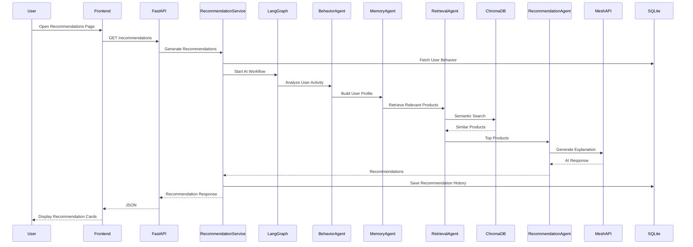
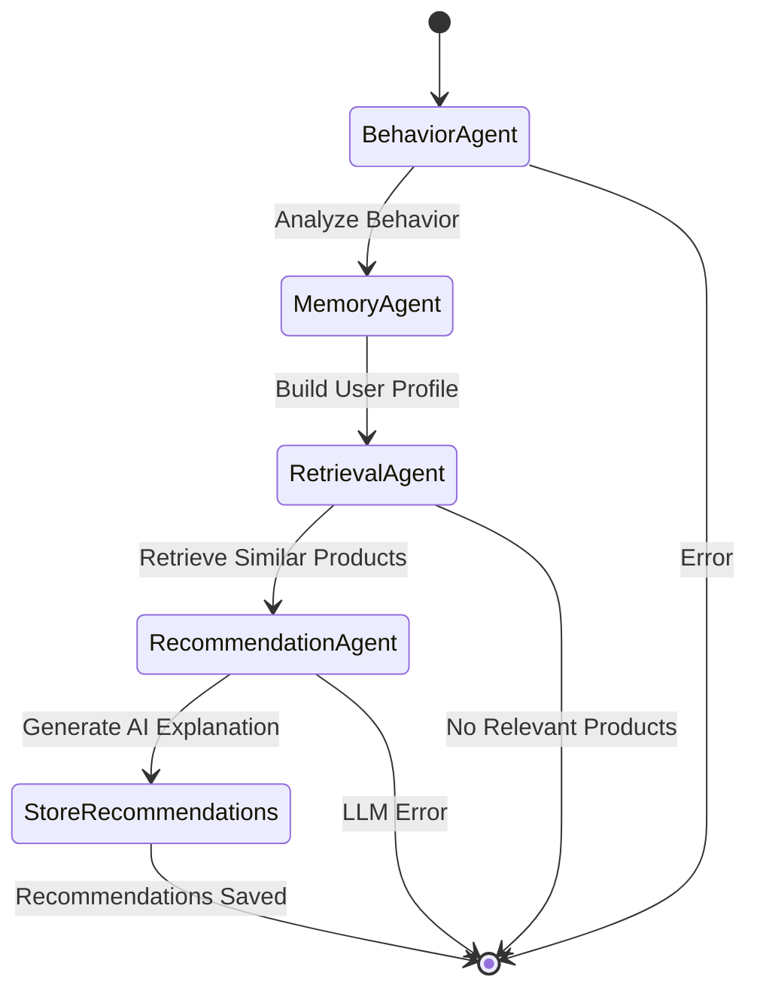
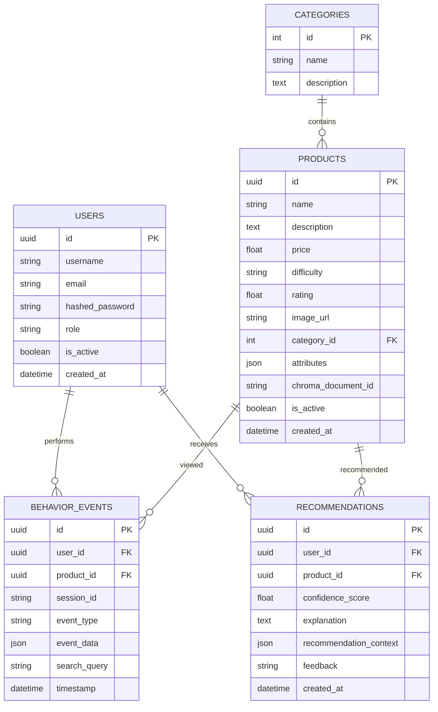
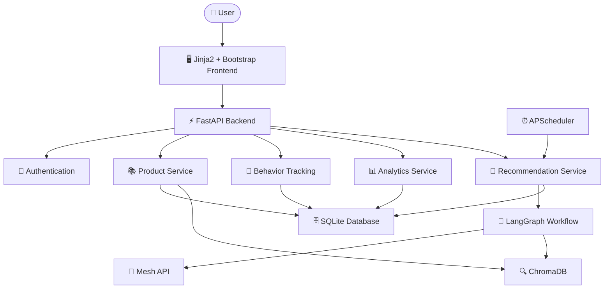

# 🧠 SmartReco

> **Behavioral AI Recommendation Platform powered by FastAPI, LangGraph, ChromaDB and Mesh API**

## 📖 Project Description

**SmartReco** is a production-inspired **Behavioral AI Recommendation Platform** that transforms user interactions into intelligent, personalized recommendations. Instead of relying on traditional popularity-based suggestions, SmartReco continuously observes user behavior—such as browsing history, searches, clicks, and product views—to understand individual interests and learning preferences.

The platform leverages a **multi-agent AI workflow built with LangGraph**, where specialized agents analyze behavioral patterns, build dynamic user profiles, retrieve semantically relevant products from **ChromaDB** using **Retrieval-Augmented Generation (RAG)**, and generate persuasive, human-like recommendation explanations using **Large Language Models** through the **Mesh API**.

Designed with real-world production principles, SmartReco features **dual-write synchronization** between SQLite and ChromaDB, efficient behavioral event tracking, background recommendation scheduling with APScheduler, interactive analytics dashboards, and a modern responsive user interface. The modular architecture enables scalable AI workflows, efficient recommendation generation, and seamless integration with different LLM providers.

SmartReco demonstrates how **Behavioral Analytics, Agentic AI, Semantic Search, and Generative AI** can be combined to build an intelligent recommendation system capable of delivering personalized user experiences for modern learning platforms, e-commerce applications, and digital marketplaces..


---

## ✨ Features

- 🔐 Secure User Authentication (JWT)
- 👨‍💼 Admin Product Management
- 📚 AI Course Catalog
- 👀 Real-time Behavioral Tracking
- 🧠 LangGraph Multi-Agent Workflow
- 🔍 ChromaDB Semantic Retrieval (RAG)
- 🤖 Personalized AI Recommendations
- 💬 LLM-generated Persuasive Explanations
- 📊 Interactive Analytics Dashboard
- 📈 User Behavior Insights
- 🖼️ Rich Product Cards with Images
- ⏰ APScheduler Background Jobs
- ⚡ FastAPI REST APIs
- 🎨 Modern Responsive UI

---

## 🚀 Architecture

```
                        User
                          │
                          ▼
                 FastAPI Application
                          │
        ┌─────────────────┼──────────────────┐
        ▼                 ▼                  ▼
 Authentication      Analytics        Recommendation
        │                 │                  │
        └─────────────────┼──────────────────┘
                          ▼
                 LangGraph Workflow
                          │
      ┌───────────────────┼───────────────────┐
      ▼                   ▼                   ▼
 Behavior Agent      Memory Agent      Retrieval Agent
                          │
                          ▼
               Recommendation Agent
                          │
          ┌───────────────┴───────────────┐
          ▼                               ▼
      SQLite Database                ChromaDB
          │                               │
          └───────────────┬───────────────┘
                          ▼
                     Mesh API / Groq
```


---

# 📖 Project Overview

SmartReco is a production-inspired Behavioral AI Recommendation Platform designed to deliver personalized learning recommendations by combining user behavior analytics, semantic search, Retrieval-Augmented Generation (RAG), and agentic AI workflows.

Unlike traditional recommendation systems that rely only on product similarity or popularity, SmartReco continuously observes user interactions, understands evolving interests, retrieves the most relevant products from a vector database, and generates personalized explanations using Large Language Models.

The recommendation pipeline is implemented as a multi-agent workflow using LangGraph, allowing each AI agent to focus on a specific responsibility before collaboratively producing the final recommendation.

The platform demonstrates how modern AI systems combine behavioral analytics, vector search, and LLM reasoning to create intelligent recommendation experiences suitable for real-world learning platforms.

---

# 🎯 Problem Statement

Traditional recommendation engines often recommend products based only on popularity or simple collaborative filtering, ignoring the user's actual browsing behavior and evolving interests.

SmartReco addresses this problem by:

- Tracking meaningful user interactions.
- Understanding user interests through AI agents.
- Retrieving semantically relevant products using ChromaDB.
- Generating persuasive AI-powered recommendation explanations.
- Continuously improving recommendations as new behavior is recorded.

---

# 💡 Key Highlights

- Multi-Agent AI Recommendation Workflow
- Behavioral Analytics
- Retrieval-Augmented Generation (RAG)
- Semantic Product Search
- Personalized AI Explanations
- Real-Time Recommendation Updates
- Interactive Analytics Dashboard
- Background Recommendation Scheduler
- Modular Service-Oriented Architecture

---

# 🛠 Technology Stack

| Layer | Technology |
|--------|------------|
| Backend | FastAPI |
| Database | SQLite |
| ORM | SQLAlchemy |
| Authentication | JWT |
| Frontend | Jinja2 + Bootstrap 5 |
| AI Workflow | LangGraph |
| LLM | Mesh API (OpenAI Compatible) |
| Development LLM | Groq |
| Vector Database | ChromaDB |
| Embeddings | Sentence Transformers |
| Scheduler | APScheduler |
| Charts | Chart.js |
| Styling | Bootstrap + Custom CSS |
| Logging | Python Logging |
| Environment | Python 3.11 |

---

# 🚀 Core Features

## 👤 User Features

- Secure Registration & Login
- Personalized Recommendation Dashboard
- AI Recommendation History
- Product Browsing
- Semantic Search
- Behavioral Tracking
- Interactive Recommendation Explanations

## 👨‍💼 Admin Features

- Product CRUD
- Category Management
- Analytics Dashboard
- Behavior Monitoring
- Recommendation Monitoring

## 🤖 AI Features

- Behavior Analysis Agent
- User Memory Agent
- Semantic Retrieval Agent
- Recommendation Generation Agent
- Persuasive Recommendation Explanations
- Vector Similarity Search
- Recommendation Confidence Scores

## 📊 Analytics

- User Statistics
- Product Statistics
- Behavior Events
- Recommendation Trends
- Search Analytics
- Popular Categories
- Most Active Users


---

# 📂 Project Structure

```text
SmartReco
│
├── app
│   ├── agents                # LangGraph AI agents
│   ├── api                   # FastAPI routers
│   ├── auth                  # Authentication
│   ├── database              # Database configuration
│   ├── models                # SQLAlchemy models
│   ├── repositories          # Data access layer
│   ├── schemas               # Pydantic schemas
│   ├── services              # Business logic
│   ├── static                # CSS, JavaScript, Images
│   ├── templates             # Jinja2 templates
│   ├── utils                 # Helper utilities
│   └── vectorstore           # ChromaDB integration
│
├── data                      # SQLite & ChromaDB
├── logs
├── run.py
├── requirements.txt
├── README.md
└── .env
```

---

# ⚙️ Installation

## Clone Repository

```bash
git clone https://github.com/<your-username>/smartreco.git

cd smartreco
```

## Create Virtual Environment

```bash
python -m venv venv
```

### Windows

```bash
venv\Scripts\activate
```

### Linux / macOS

```bash
source venv/bin/activate
```

## Install Dependencies

```bash
pip install -r requirements.txt
```

---

# 🔑 Environment Variables

Create a `.env` file in the project root.

```env
APP_NAME=SmartReco

SECRET_KEY=your_secret_key

DATABASE_URL=sqlite:///./data/smartreco.db

CHROMA_PERSIST_DIR=./data/chroma

EMBEDDING_MODEL=all-MiniLM-L6-v2

LLM_PROVIDER=mesh

MESH_API_KEY=your_mesh_api_key

MODEL_NAME=openai/gpt-4.1-mini
```

---

# ▶️ Running the Application

Start the FastAPI server:

```bash
python run.py
```

Open your browser:

```
http://127.0.0.1:8000
```

Swagger API Documentation:

```
http://127.0.0.1:8000/docs
```

Analytics Dashboard:

```
http://127.0.0.1:8000/analytics
```

---

# 📡 API Overview

| Module | Description |
|---------|-------------|
| Authentication | User registration and login |
| Products | Product CRUD and semantic indexing |
| Recommendations | AI-generated recommendations |
| Behavior | User activity tracking |
| Analytics | Dashboard metrics and charts |
| Search | Semantic product search |
| Admin | Administrative operations |

---

---

# 🔄 Recommendation Request Flow

The following sequence diagram illustrates how SmartReco generates personalized recommendations from user behavior.



---

# 🤖 LangGraph AI Agent Workflow

SmartReco uses a modular **LangGraph** workflow where each AI agent has a specialized responsibility. This architecture keeps the recommendation pipeline maintainable, scalable, and easy to extend.



---

# 🗄️ Database Entity Relationship Diagram

The SmartReco database is designed around five core entities: **Users**, **Categories**, **Products**, **Behavior Events**, and **Recommendations**.



---

# 🏗️ Overall System Architecture

The following diagram illustrates how the frontend, backend, AI agents, databases, scheduler, and LLM work together to generate personalized recommendations.



### Architecture Components

| Component | Responsibility |
|-----------|----------------|
| **Frontend** | User interface built with Jinja2 templates and Bootstrap |
| **FastAPI** | REST APIs and server-side rendering |
| **Behavior Tracking** | Records user interactions such as searches, clicks, and product views |
| **Recommendation Service** | Coordinates AI recommendation generation |
| **LangGraph** | Multi-agent orchestration workflow |
| **Mesh API** | Generates AI-powered recommendation explanations |
| **ChromaDB** | Semantic vector search using embeddings |
| **SQLite** | Stores users, products, behavior events, and recommendations |
| **Analytics** | Generates dashboards and behavioral insights |
| **APScheduler** | Background recommendation refresh jobs |

### Database Design Highlights

- **Users** store authentication and authorization information.
- **Categories** organize products into logical groups.
- **Products** are synchronized with both SQLite and ChromaDB for semantic retrieval.
- **Behavior Events** capture user interactions such as page views, searches, clicks, and product views.
- **Recommendations** store AI-generated recommendations, confidence scores, explanations, and user feedback for future analysis.

### Agent Responsibilities

| Agent | Responsibility |
|--------|----------------|
| **Behavior Agent** | Analyzes browsing history, searches, clicks and page views |
| **Memory Agent** | Creates a concise summary of user interests |
| **Retrieval Agent** | Performs semantic search on ChromaDB using embeddings |
| **Recommendation Agent** | Generates persuasive recommendation explanations using Mesh API |
| **Store Recommendations** | Saves generated recommendations into SQLite for future retrieval |

# 🤖 AI Agent Workflow

SmartReco uses a modular multi-agent workflow powered by **LangGraph**. Each agent has a single responsibility, making the recommendation pipeline maintainable and scalable.

```text
                 User Activity
                        │
                        ▼
            Behavioral Tracking API
                        │
                        ▼
              Behavior Analysis Agent
                        │
                        ▼
                 User Memory Agent
                        │
                        ▼
              Retrieval Agent (RAG)
                        │
            Semantic Search (ChromaDB)
                        │
                        ▼
          Recommendation Generation Agent
                        │
                        ▼
           Personalized AI Recommendation
                        │
                        ▼
              Store Recommendation
                        │
                        ▼
              Recommendation Dashboard
```

### Agent Responsibilities

| Agent | Responsibility |
|--------|----------------|
| Behavior Agent | Analyzes user interactions and browsing behavior |
| Memory Agent | Builds a concise profile of user interests |
| Retrieval Agent | Retrieves semantically relevant products from ChromaDB |
| Recommendation Agent | Generates persuasive AI-powered recommendation explanations |

---

# 🗄 Database Schema

```text
Users
│
├── id
├── username
├── email
└── role
      │
      │
      ├──────────────┐
      ▼              ▼
BehaviorEvents   Recommendations
      │              │
      ▼              ▼
Products ───────── Categories
```

### Main Tables

- Users
- Categories
- Products
- Behavior Events
- Recommendations

---

# 🚀 Future Improvements

- Recommendation caching
- LLM response caching
- Event batching and throttling
- Metadata-based retrieval re-ranking
- LangSmith observability
- Email recommendation digests
- Telegram notifications
- Redis caching
- PostgreSQL deployment
- Docker support
- CI/CD pipeline
- Kubernetes deployment

# 📸 Application Screenshots

## Home


## Product Catalog


## Recommendations


## Analytics Dashboard


---

# 👨‍💻 Author

## Nimish Pathak

**AI Engineer | Machine Learning | Generative AI | Agentic AI | RAG Systems**

- 💼 LinkedIn: https://www.linkedin.com/in/nimish-pathak

If you found this project interesting or helpful, **please consider giving this repository a ⭐ on GitHub.** Your support is greatly appreciated!